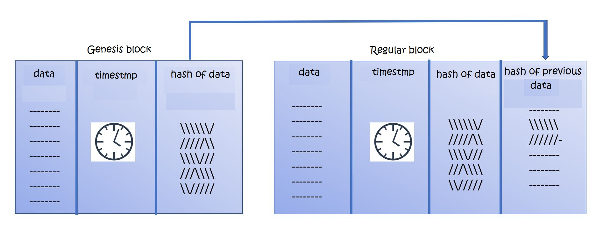
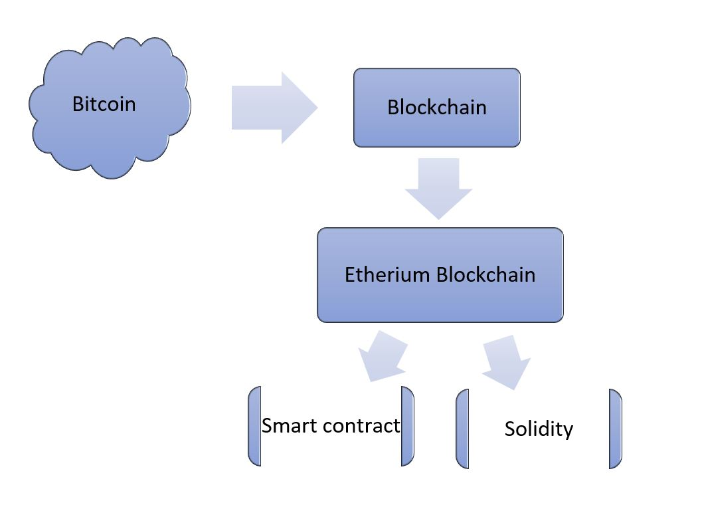

# Blockchain-practice
Understanding the basics of blockchain by doing it.
Hands on excercise with various implementations of blockchain in Jupyter notebook.


### Quotes from internet, Blockchain is...

... a distributed database with a set of rules for verifying new additions to the database. 

... a digital ledger in which transactions made in bitcoin or another cryptocurrency are recorded chronologically and publicly.

... just a file.  A blockchain by itself is just a data structure.  That is, how data is logically put together and stored. 

... a book of pages. Blocks in a chain = pages in a book, each page in a book contains the text and information about itself


### The Block

```shell
import datetime as date
import hashlib as hash

class Block:
    def __init__(self, index, timestamp, data, prev_hash):
        self.index = index
        self.timestamp = timestamp
        self.data = data
        self.prev_hash = prev_hash
        self.hash = hash.sha256(data).hexdigest()
    def __repr__(self):
        return "{0} : {1}, {2}, {3} ".format(self.index, str(self.timestamp), self.data, self.prev_hash)
```

### Genesis vs regular block



```shell
#this is a special block in the blockchain
#as its the very first block, it could not have hash of previous block
def getGenesisBLock():
    return Block(0, date.datetime.now(), "the genesis block", "0")
```

```shell
#each consicutive block will holds the timestamp and the hash of the previous block
#storing the hash of previous block is a way to maintain long chain on internet
def getNextBlock(prev_block):
    index = prev_block.index + 1
    timestamp = date.datetime.now()
    data = "this is block # {0}".format(str(index))
    hash = prev_block.hash
    return Block(index, timestamp, data, hash)
```

### The Blockchain


```shell
#create a blockchain with first block as Genesis block  
bc = [getGenesisBLock()]
```

```shell
#keep adding blocks
prev_block = bc[0]

new_block = getNextBlock(prev_block)
bc.append(new_block)
```

```bash
for block in bc:
    print block
	
0 : 2017-12-24 18:50:10.277000, the genesis block, 0 ,
1 : 2017-12-24 18:50:10.277000, this is block # 1, adefd71a6d99e989ec041e9dbdd340a09f7f2be25835d5df865ea00531c5d867
```

```shell
#the way to validate blochchain is simple; 
#hash of previous block must be identical with current blocks 'previous block hash' field!
for curr_block in range(1, len(bc)):
    prev_block = curr_block -1
    if bc[prev_block].hash == bc[curr_block].prev_hash:
        print("Block {0} is Valid".format(curr_block))
    else:
        print("Block {0} is Invalid".format(curr_block))
        break
```


### Ethereum is ...



... a blockchain system based on the concepts of bitcoin.
It is considered a second generation blockchain technology that was designed to let any person, with a basic level of computer skills, to develop and deploy their own decentralized applications on the Blockchain.

Smart contracts are autonomous computer systems, written in code, that manage executions between individuals on the Blockchain.

### My soruce for reading
https://medium.com/blockchain-review/how-does-the-blockchain-work-for-dummies-explained-simply-9f94d386e093
https://www.oreilly.com/ideas/understanding-the-blockchain
